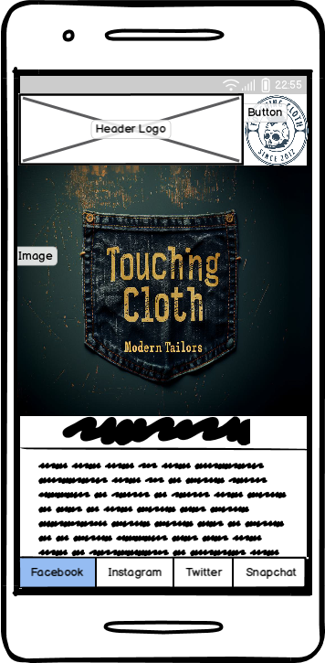
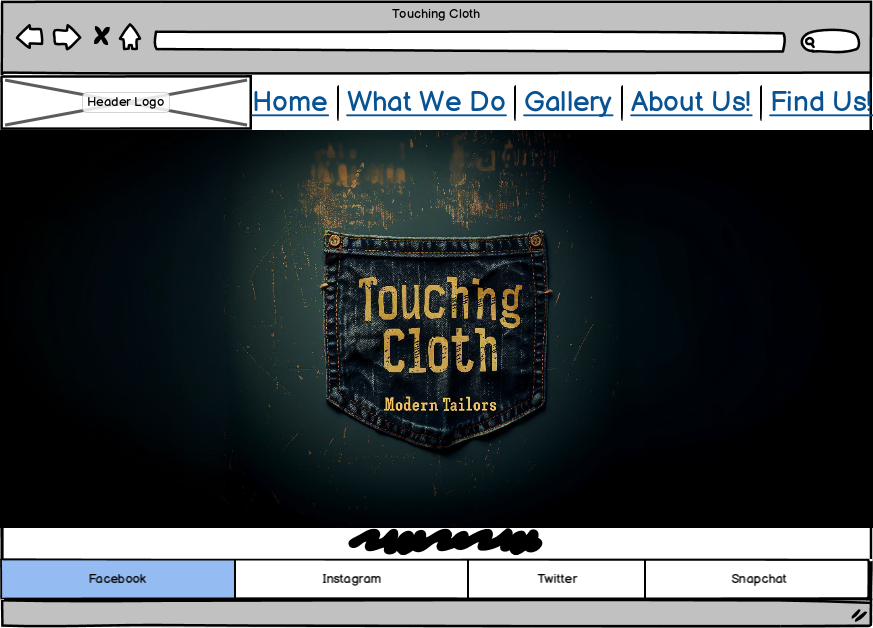

# Touching Cloth 

This is a website for a tailors called "Touching Cloth" aimed at potential customers for the store. It will include a rundown of services provided, and costs where applicable, aswell as images of the store, the workshop, and finished products. Customers will also be able to access the stores social media, sign up to a mailing list, and access contact details/address & map of the location.

## Features 

This section shll contain the different parts/features of the site, explaining what each is for and what value it holds for the end user and how it helps them achieve that goal.

 Favicon created in GIMP2.10.36 and exported as .ico files for compatability, and then used Inkscape to convert the original png to svg file to maximise compatability, I feel that this should cover all possible accepted fileypes cross-platform.

Smooth transition dropdown menu to add visual flair and give a good user experience.

### Existing Features

### Features Left to Implement

## Testing 

This section will detail testing as each feature is implimented ensuring that everything works as inteded. Notes will be made regarding how the website looks and feels on different browsers & screen sizes.

Any bugs encountered will be documented here.

### Validator Testing 

- HTML
  - Test the website by passing through the official [W3C validator](https://validator.w3.org/)
- CSS
  - Test the website by passing through the official [(Jigsaw) validator](https://jigsaw.w3.org/css-validator/)

### Unfixed Bugs

Any unfixed bugs will be detailed here and explinations as to why they haven not been fixed. This section should include shortcomings of the frameworks or technologies used. Although time can be a big variable to consider, paucity of time and difficulty understanding implementation is not a valid reason to leave bugs unfixed.

## Deployment

This section will describe the process gone through to deploy the project to a hosting platform

A live link will be provided here

## Credits 

In this section I will refrence the sources of my content and media, full disclosure of any resources used shall be detailed here.

Balsamic used for wireframe mockups.

Hero image generated with Midjourney AI Image generator using the prompt: "professional line-art vector style logo for a modern tailoring company called "Touching Cloth Modern Tailors", professional brand design look in the style of Yoji Shinkawa, James Gilleard and Greg Rutkowski. logo, pocket and stitching illustration, simple, minimalistic, transparent background, using a simple and clean font --s 750 --v 6.0 --ar 103:46"

Logo created using Gnome Image Manipulation Program (GIMP 2.10.36)

Favicon created in GIMP2.10.36 then exported as .ico files of relevent size, .svg icon file converted using Inkscape.

### Content 

### Media