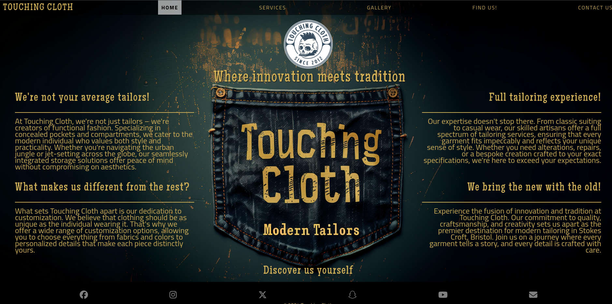
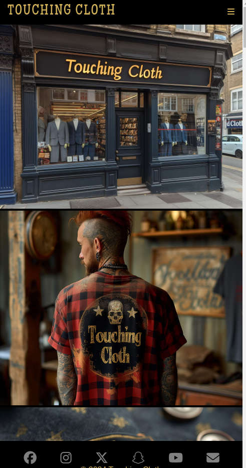
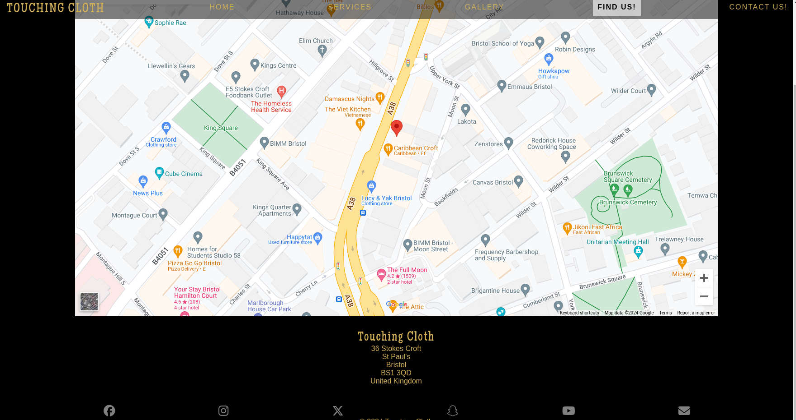

# [Touching Cloth](https://hedgemonkey.github.io/project1 "Click to view the deployed site")

- "Touching Cloth" is a website for a tailor aimed at potential customers for the store.
- "Touching Cloth" includes a rundown of services provided.
- "Touching Cloth" has a gallery with images of the store, the workshop, and finished products.
- "Touching Cloth" visitors will also be able to access the stores' social media and sign up for a mailing list.
- "Touching Cloth" has a Find Us page with access to the address & interactive Google maps of the location of the store.

## Contents

Click here for Table of Contents

[Responsive Screenshots](#responsive-screenshots)

[Wireframes Screenshots](#wireframes-screenshots)

[UX](#ux)

[Features](#features)

[Testing](#testing)

[Deployment](#deployment)

[Credits](#credits)

## Responsive Screenshots

Below is a screenshot showing the responsive design of the website created using the "Am I Responsive website. [Link Here](https://ui.dev/amiresponsive?url=https://hedgemonkey.github.io/project1)
| "Am I Responsive" Screenshot |
| :---: |
|  |

[Back to top](#contents)

## Wireframes Screenshots

Following best practices, wireframe mock-ups were made to give a rough initial vision for the design and layout of the website.
I used [Balsamiq](https://balsamiq.com/wireframes) to make these initial mockups.

| Smartphone/Tablet View | Desktop View |
| :---: | :---: |
|  |  |

[Back to top](#contents)

## UX

- The original design was created from the wireframe mockups shown above with a "Mobile First" design philosophy.
- Ease of use and intuitive design were kept in mind throughout.
- Design was made to seamlessly incorporate the brand identity of the store throughout.

[Back to top](#contents)

### Colour Scheme

The colour scheme that was chosen is intended to keep with the brand aesthetic while also maximising accessibility and readability on all devices.\
The colours used are:

-  'rgb(0,0,0)' black default background to integrate with the brand hero image used.
-  'rgb(207,174,88)' to match the colour of the text in the brand image for all other text which also gives a high accessibility rating on the black background
-  'rgba(255, 255, 255, 0.6)' white background with mid-low transparency for the active page links to clearly indicate the current active page.
-  'rgb(0,0,0)' for the text of the currently active nav link to keep easy readability and accessibility
-  'grey' colour used for the social media links on the footer with 'rgb(207,174,88)' on hover
-  white colour is used for some shadow effects and hover of navigation to maximize the user experience
-  'rgb(111, 100, 255)' used for the plain text newsletter link on the main page to keep a high contrast ratio with the background while also making it clear to the user that it's function

[Back to top](#contents)

### Typography

- Google Fonts used sitewide for "Touching Cloth"

- '[Maiden Orange](https://fonts.google.com/specimen/Maiden+Orange)' was chosen for similarities to the brand and used site-wide due to its diversity

- [Font Awesome](https://fontawesome.com) icons were used in the footer for social media links.

[Back to top](#contents)

## User Stories

### New and/or Returning Users

- As a new and/or returning user, I would like to find out information about the services offered by "Touching Cloth"
- As a new and/or returning user, I would like to be able to find out where "Touching Cloth" is located
- As a new and/or returning user, I would like to see examples of the products/services offered by "Touching Cloth"
- As a new and/or returning user, I would like to be able to get in contact with "Touching Cloth"
- As a new and/or returning user, I would like to sign up for the newsletter for 'Touching Cloth'
- As a new user, I would like to quickly find out what "Touching Cloth" is about

[Back to top](#contents)

## Features 

## Smooth Transition Drop-down Menu

Smooth transition dropdown menu to add visual flair and give a good user experience.

[Back to top](#contents)

### Existing Features

#### Favicon

 Favicon created in GIMP2.10.36 and exported as .ico files for compatibility, and then used Inkscape to convert the original PNG to SVG file to maximise compatibility, I feel that this should cover all possible accepted filetypes cross-platform.

[Back to top](#contents)

#### Responsive Navigation

A responsive navigation was used so that the site is useable across all devices\

| Large Nav |
| :---: |
|  |

| Small Navigation Closed | Small Navigation Open |
| :---: | :---: |
|  |  |

[Back to top](#contents)

#### Responsive Home Page

A responsive home page was used to display content on the home page while efficiently using up potential dead space on larger displays

| Large Home Page |
| :---: |
|  |

| Small Home Page | Medium Home Page |
| :---: | :--: |
|  |  |

[Back to top](#contents)

#### Responsive Gallery Page

A responsive 'Gallery' page was used to display the images efficiently across different screen sizes

| Large Gallery Page |
| :---: |
|  |

| Small Gallery Page | Medium Gallery Page |
| :---: | :--: |
|  |  |

[Back to top](#contents)

#### Responsive Services Page

A responsive 'Services' page was used to display the services efficiently across different screen sizes

| Large Services Page |
| :---: |
|  |

| Small Services Page | Medium Services Page |
| :---: | :--: |
|  |  |

[Back to top](#contents)

#### Contact Page

A form with the option to sign up for the newsletter was used on the 'Contact Us' page, and full form validation was implemented with required and optional fields clearly marked

| Contact Form |
| :---: |
|  |

[Back to top](#contents)

#### Responsive Google Maps

A responsive 'Find Us' page was implemented using Google Maps via an iframe

| Large Map Page | Small Map Page |
| :---: | :---: |
|  |  |

[Back to top](#contents)

### Features Left to Implement

I would like to add a 'Quote Calculator' in the future, and possibly a 'Special offers & Deals' section.

[Back to top](#contents)

## Testing 

Any bugs encountered will be documented here.

[Back to top](#contents)

### General miscellaneous bugs:

Fixed bug where incorrect ID was being used for title-logo on contact.html

Fixed the accessibility issue where the link to sign up for the newsletter on index.html didn't have a high enough contrast ratio to the background by adjusting the styles.

[Back to top](#contents)

### Tested the slide-down menu function:

- Initially sliding function wasn't working as expected however problem was resolved by using "visibility: hidden" instead of "display: none" After this change CSS transition operated as expected. 

- Updated max-height to be large enough to allow for all menu items to be listed and visible.

- Fixed bug where the top bar was scrolling with the rest of the page.

- Fixed bug where the "max-height" under the nav element of CSS was preventing navigation from displaying after media query of screen size 768px and above.

[Back to top](#contents)

### Contact page testing and bugs

- Fixed text-align issue for input to textfield for a message where it was being centred, so changed to text-align left.

[Back to top](#contents)

### Find Us Page

- Fixed a bug where the footer covered the bottom of the content.

[Back to top](#contents)

### Contact Page

- Fixed a bug causing the footer to cover the bottom of the page.

### Gallery

- Fixed a duplicate img href picture in the gallery to point to the correct file.

### Hero image

- Hero image didn't display as wanted, also raised concerns that the hero image would interfere with the slide-down navigation menu. So decided to utilize the space provided at the top of the hero image rather than adjust it for easy readability of Menu options, however, something is needed to fill this blank space.

 

- Dead space used for a brand logo, and navigation bar will be styled to prevent any colour scheme issues.

[Back to top](#contents)

### Validator Testing 

- HTML
  - All pages passed testing with the [W3C validator](https://validator.w3.org/)

- CSS
  - The CSS passed by testng with [(Jigsaw) validator](https://jigsaw.w3.org/css-validator/) 
  

[Back to top](#contents)

### Unfixed Bugs

Currently no known unfixed bugs.

[Back to top](#contents)

## Deployment

The site was deployed to GitHub Pages. The steps to deploy are as follows:

- In the [GitHub repository](https://github.com/hedgemonkey/project1), navigate to the Settings tab.
- From the source section drop-down menu, select the **Main** Branch, then click "Save".
- The page will be automatically refreshed with a detailed ribbon display to indicate the successful deployment.

The live link can be found [here](https://hedgemonkey.github.io/project1)

[Back to top](#contents)

### Local Deployment

You can clone or fork this project to make a local copy on your system.

[Back to top](#contents)

#### Cloning

You can clone the repository by following these steps:

1. Go to the [GitHub repository](https://github.com/hedgemonkey/project1).
2. Locate the Code button above the list of files and click it.
3. Select if you prefer to clone using HTTPS, SSH, or GitHub CLI and click the copy button to copy the URL to your clipboard.
4. Open Git Bash or Terminal.
5. Change the current working directory to the one where you want the cloned directory.
6. In your IDE Terminal, type the following command to clone my repository:
    - `git clone https://github.com/boderg/your-weather.git`
7. Press Enter to create your local clone.

[Back to top](#contents)

#### Forking

By forking the GitHub Repository, we make a copy of the original repository on our GitHub account to view and/or make changes without affecting the original owner's repository.
You can fork this repository by using the following steps:

1. Log in to GitHub and locate the [GitHub Repository](https://github.com/hedgemonkey/project1).
2. At the top of the Repository (not the top of the page) just above the "Settings" Button on the menu, locate the "Fork" Button.
3. Once clicked, you should now have a copy of the original repository in your own GitHub account.

[Back to top](#contents)

### Local vs Deployment

There are no notable differences between my locally developed site and the GitHub pages deployed site.

[Back to top](#contents)

## Credits 

In this section, I will reference the sources of my content and media, full disclosure of any resources used shall be detailed here.

- Balsamic used for wireframe mockups.

- Hero image generated with Midjourney AI Image generator using the prompt: "professional line-art vector style logo for a modern tailoring company called "Touching Cloth Modern Tailors", professional brand design look in the style of Yoji Shinkawa, James Gilleard and Greg Rutkowski. logo, pocket and stitching illustration, simple, minimalistic, transparent background, using a simple and clean font --s 750 --v 6.0 --ar 103:46"

- Logo created using Gnome Image Manipulation Program (GIMP 2.10.36)

- Favicon created in GIMP2.10.36 then exported as .ico files of relevant size, .svg icon file converted using Inkscape.

- All images in the gallery were generated using Midjourney you can find my Discord server used to generate all the images used on this site [HERE](https://discord.gg/zMJjhgub)

- https://raw.githubusercontent.com/boderg/your-weather/main/README.md was used as a template for my README.md

[Back to top](#contents)

### Content 

Chat GPT is used to generate content for the index page with the query "Create some text for a website welcome page for a modern tailors in Stokes Croft, Bristol called "Touching Cloth" that specializes in concealed pockets/compartments in clothing as well as other standard tailoring services and customizations"

[Back to top](#contents)

### Media

All media on this site was generated using Midjourney as documented above

[Back to top](#contents)

### Acknowledgements

- I would like to thank my Code Institute mentor, [Chris Quinn](https://github.com/10xOXR) for their support throughout the development of this project.
- I would like to thank the [Code Institute Slack community](https://code-institute-room.slack.com) for the moral support and general information that helps with my studies.
- I would like to also thank ChatGPT for filling in all the textual content which saved me a lot of bother!

[Back to top](#contents)