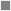

# [Touching Cloth](https://hedgemonkey.github.io/project1 "Click to view the deployed site")

- "Touching Cloth" is a website for a tailors aimed at potential customers for the store.
- "Touching Cloth" includes a rundown of services provided.
- "Touching Cloth" has a gallery with images of the store, the workshop, and finished products.
- "Touching Cloth" visitors will also be able to access the stores social media, and sign up to a mailing list.
- "Touching Cloth" has a Find us page with access the address & interactive google maps of the location of the store.

Click here for Table of Contents

[Responsive Screenshots](#responsive-screenshots)

[Wireframes Screenshots](#wireframes-screenshots)

[UX](#ux)

[Features](#features)

[Testing](#testing)

[Deployment](#deployment)

[Credits](#credits)

## Responsive Screenshots

Below is a screenshot showing the responsive design of the website created using the "Am I Responsive website. [Link Here](https://ui.dev/amiresponsive?url=https://hedgemonkey.github.io/project1)
| "Am I Responsive" Screenshot |
| :---: |
|  |

## Wireframes Screenshots

Following best practices, wireframe mock ups were made to give a rough initial vision for the design and layout of the website.
I used [Balsamiq](https://balsamiq.com/wireframes) to make these initial mockups.

| Smartphone/Tablet View | Desktop View |
| :---: | :---: |
|  |  |

## UX

- The original design was created from the wireframe mockups shown above with a "Mobile First" design philosophy.
- Ease of use and intuitive design was kept in mind throughout.
- Design was made to seamlessly incorporate the brand identity of the store thoughout.

### Colour Scheme

The colour scheme that was choosen is intended to keep with the brand asthetic while also maximising accessability and readability on all devices.\
The colours used are:

-  'rgb(0,0,0)' black default background to intergrate with the brand hero image used.
-  'rgb(207,174,88)' to match the colour of the text in the brand image for all other text which also gives a high accessability rating on the black background
-  'rgba(255, 255, 255, 0.6)' white background with mid-low transparency for the active page links to clearly indicate the current active page.
-  'rgb(0,0,0)' for text of the currently active nav link to keep easy readbility and accessability
-  'grey' colour used for the social media links on the footer with 'rgb(207,174,88)' on hover
-  white colour is used for some shadow effects and hover of navigation to maximize the user experience
-  'rgb(111, 100, 255)' used for the plain text newsletter link on the main page to keep a high contrast ratio with the background while also making it clear to the user of it's function

## Features 

This section shall contain the different parts/features of the site, explaining what each is for and what value it holds for the end user and how it helps them achieve that goal.

 Favicon created in GIMP2.10.36 and exported as .ico files for compatability, and then used Inkscape to convert the original png to svg file to maximise compatability, I feel that this should cover all possible accepted fileypes cross-platform.

Smooth transition dropdown menu to add visual flair and give a good user experience.

Fully responsive website for all screen sizes.

Interactive google map of location on "Find Us" page.

### Existing Features

### Features Left to Implement

## Testing 

This section will detail testing as each feature is implimented ensuring that everything works as inteded. Notes will be made regarding how the website looks and feels on different browsers & screen sizes.

Any bugs encountered will be documented here.

### General miscellaneous bugs:

Fixed bug where incorrect id was being used for title-logo on contact.html

Fixed accessability issue where the link to sign up to the newsletter on index.html didn't have a high enough contrast ratio to the background by adjusting the styles.

### Tested the slide-down menu function:

Initially sliding function wasn't working as expected however problem resolved by using "visibility: hidden" instead of "display: none" after this change CSS transition operated as expected. 

Updated max-height to be large enough to allow for all menu items to be listed and visible.

Fixed bug where the top bar was scrolling with the rest of the page.

Fixed bug where the "max-height" under the nav element of CSS was preventing navigation from displaying after media query of screen size 768px and above.

### Contact page testing and bugs

Fixed text-align issue for input to textfield for message where it was being centered, so changed to text-align left.

### Find Us Page

Fixed a bug where the footer covered the bottom of the content.

### Contact Page

Fixed a bug causing the footer to cover the bottom of page.

### Gallery

Fixed a duplicate img href picture in gallery to point to the correct file.

### Hero image

Hero image didn't display as wanted, also raised concerns that the hero image would interfere with slide-down navigation menu. So decided to utilize the space provided at the top of hero image rather than adjust it for easy readability of Menu options, however something is needed to fill this blank-space.

 

Dead space used for a brand logo, navigation bar will be styled to prevent any colour scheme isues.

### Validator Testing 

- HTML
  - All pages passed testing with the [W3C validator](https://validator.w3.org/)

- CSS
  - The CSS passed by testng with [(Jigsaw) validator](https://jigsaw.w3.org/css-validator/) 
  

### Unfixed Bugs

Currently no known unfixed bugs.

## Deployment

This section will describe the process gone through to deploy the project to a hosting platform

A live link will be provided here

## Credits 

In this section I will refrence the sources of my content and media, full disclosure of any resources used shall be detailed here.

Balsamic used for wireframe mockups.

Hero image generated with Midjourney AI Image generator using the prompt: "professional line-art vector style logo for a modern tailoring company called "Touching Cloth Modern Tailors", professional brand design look in the style of Yoji Shinkawa, James Gilleard and Greg Rutkowski. logo, pocket and stitching illustration, simple, minimalistic, transparent background, using a simple and clean font --s 750 --v 6.0 --ar 103:46"

Logo created using Gnome Image Manipulation Program (GIMP 2.10.36)

Favicon created in GIMP2.10.36 then exported as .ico files of relevent size, .svg icon file converted using Inkscape.

### Content 

Chat GPT used to generate content for index page with the query "Create some text for a website welcome page for a modern tailors in Stokes Croft, Bristol called "Touching Cloth" that specializes in concealed pockets/compartments in clothing as well as other standard tailoring services and customization's"

### Media